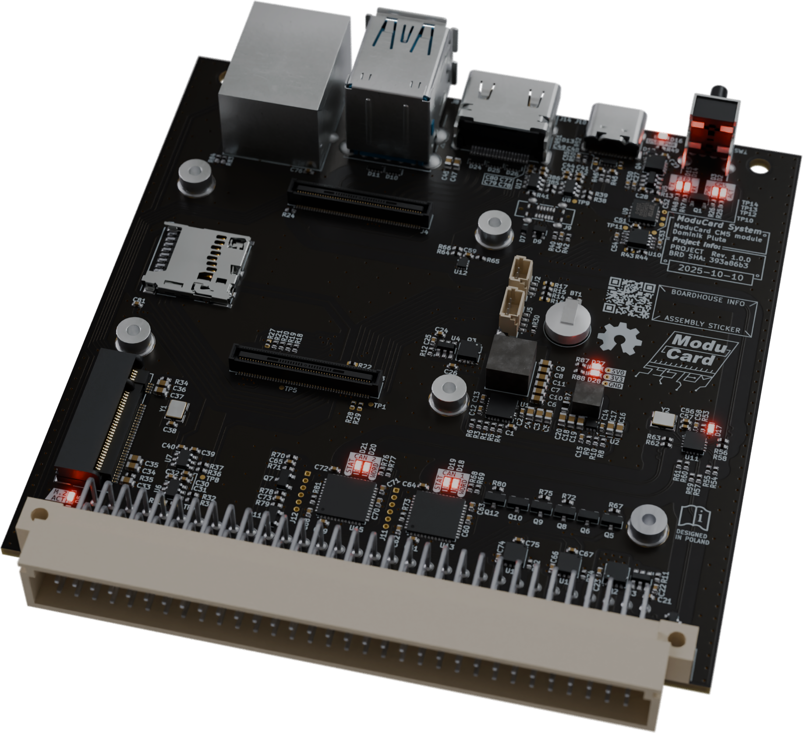

# ModuCard CM5 module
ModuCard module for **Raspberry Pi Compute Module 5**, designed to interface with the [ModuCard backplane](https://github.com/KoNarRobotics/ModuCard-backplane)

  

> [!WARNING]  
> The above image doesn't represent the finished design, as it is still a **Work In Progress**
